# 5G, 4G-LTE, 3G, 2G Cellular Mobile Communications

> Basic knowledge about telecommunication.

## GSM

Global system for Mobile Communication
-> 2G -> Voice

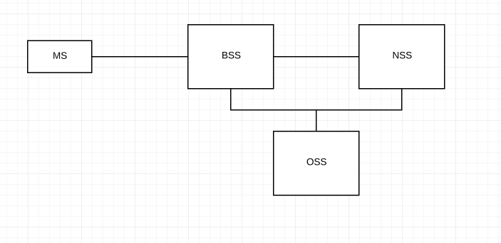

MS: Mobile station
BSS: Base Station Subsystem
NSS: Network Station Subsystem
OSS: Operation Station Subsystem

### BSS

> Base station subsystem
> Connect to __radio network__

BSS:

- BTS (base transreceiver station)
- BCS (base station controller)

SIM: subcriber identity module, contains user information.

Antenna can catch radion information, use feeder and jumper wire/connector to transmit that info to BTS.

Microwave antennas work on principle of LOS (line-of-sight)

MS->BSS:


or

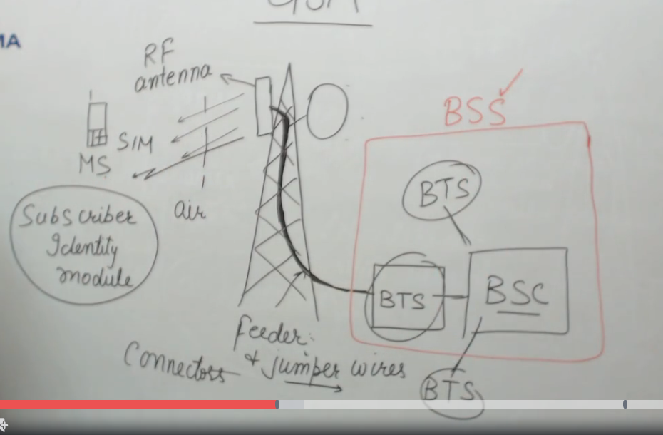

### NSS

> Network station subsystem
> Connect to __CORE network__

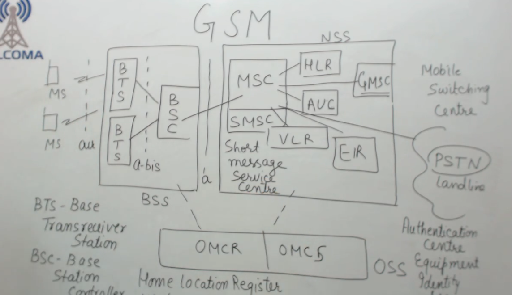

MSC: Mobile Switching center. The controller of the complete network. It has to route among multiple stations.

- HLR (Home location register): store permanent location of user
- VLR (visitor location register):
- EIR (equipment idenity register):
- AUC (authentication center)
- SMSC ()

### GSM bands

> 900 MHz, 1800 MHz, 1900 MHz

MS -> Antenna: up link 890-915 MHz
MS <- AntennaL down link 935-960 MHz

Channel spacing = DL_lowfrq - UL_highfrq (Hz)

ARFCN: absolute radio frequency channel no.

Duplex spacing = DL_lowfrq - UL_lowfrq (Hz)

### GSM Channels

2 categories:

#### Control channels/ Signalling channels

- Broadcast Channel
  - BCCH broadcast control channel
  - FCCH forward access channel
  - SCH synchronization channel
- Control Channel
  - RACH random access channel
  - AGCH access grant channel
  - PCH paging channel
- Dedicated Channel
  - SDCCH standalone dedicated control channel
  - SACCH slow associated control channel
  - FACCH fast associated control channel

##### 1. Broadcast channel

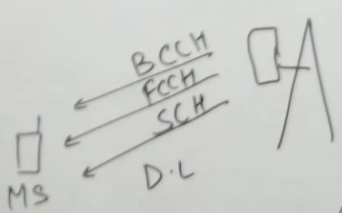

- BCCH: cell specific information
- FCCH: frequency
- SCH:  synchronize mobile station with the network (like clock channel in I2C ???)

Idle mode: not using mobile station.

##### 2. Control channel

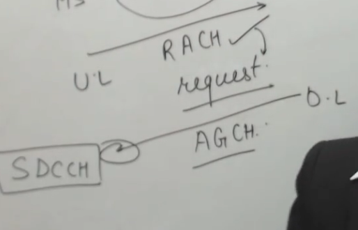

Using RACH (uplink), MS make a request to base station.

AGCH (downlink) connects to the standalone dedicated channel. SDCCH collects all processes.

Paging is a communication method between MS and base station. PCH is where all pagings are collected in the network.

##### 3. Dedicated channel

SACCH collects messages (SMS)
FACCH collects conferance call.

### GSM call flow

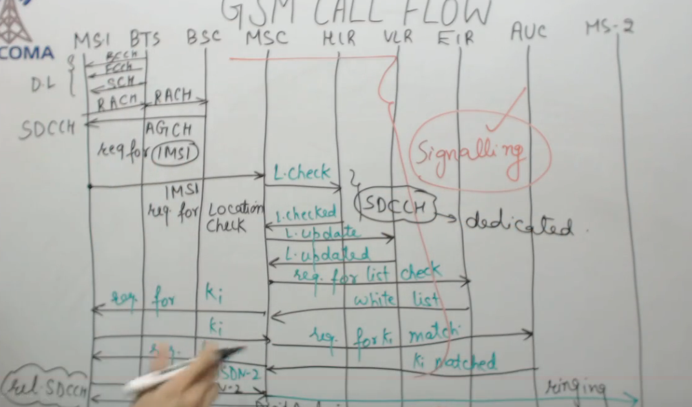

### GSM cells

Cellular technology/ Cellular structure.

Cellls: smallest coverage area.

Cells contain sectors.

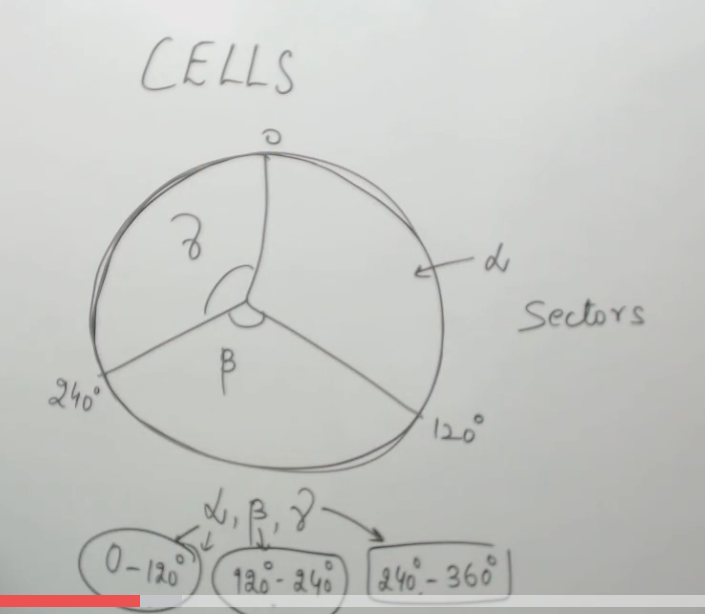

Shape of cell: hexagonal (in theory).

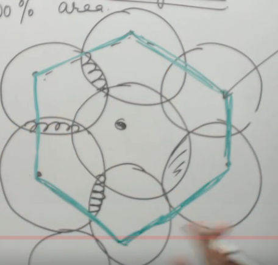

### GSM Indeitfiers

#### 1. MSISDN

>Mobile Subscriber Integrated Service Digital No.

CC + NVN

- CC country code (example: 358 in Finland)
- NVN national valid no. 10 digits.
  - MSC ID "2"
  - HIR ID "3"
  - SNR ID "5"

#### 2. IMSI

> International mobile Subscriber Identity. (15 digits)

- Mobile Country Code (3)
- Mobile Network Code (2)
- Mobile Subscriber Inter No. (10)

#### 3. BSIC

> Base station indetification code.

- NCC: network colour code - 3bits
- BSC: base station code - 3bits

#### 4. CI

> Cell Indeitfier

CI position in the whole network:
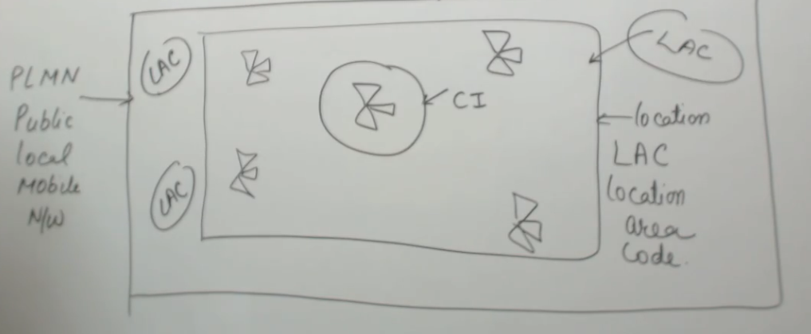

#### 5. CGI

> Cell Global Identity

- CC
- MNC
- LAC
- CI

#### 6. IMEI

> Internation mobile equipment indeitification

- TAC: 6 type approval code
- FAC: 2 final assembly code
- SNR: 6 serial number
- SP: 1 spare bit

### GPRS

#### Introduction

> General Packet Radio Service

Based on Packet Switching: wireless end to end transmission.

GPRS requires an __Agent__ in each section: PCU (Packet Control Unit). It works on the principle of segmentation and re-assembly.

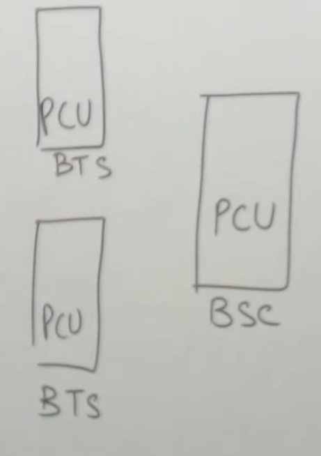

#### Architecture

#### Channels

MS - radio link - BTS

Radio link contains channels, use GSM channels + GPRS channels.

Modulation technique:

- GMSK (Gaussian Minimum Shift Keying) uses GSM
- GMSK uses GPRS as well

Channels:

```comment
# This is somewhat alike the architecture of GSM. Just add the word P standing for Packet.
```

- Control channel
  - Broadast channels (like in case of GSM)
  - Common control channels
    - PRACH: carries packet requests
    - PAGCH: carries responds
    - PNCH: packet notification channel
  - Dedicated channels
    - PSDCCH: authenticate the user

- Traffic channels
  - PTCH

### EDGE

> 2.75G
> Enhanced Data rates for GSM Evolution

Increase data rate speed x5 compared to GPRS.

Enhanced: increase data rate.

Modulation scheme:

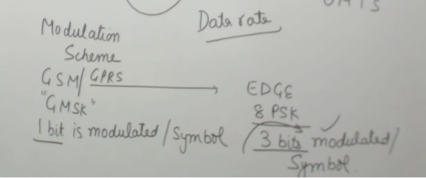

